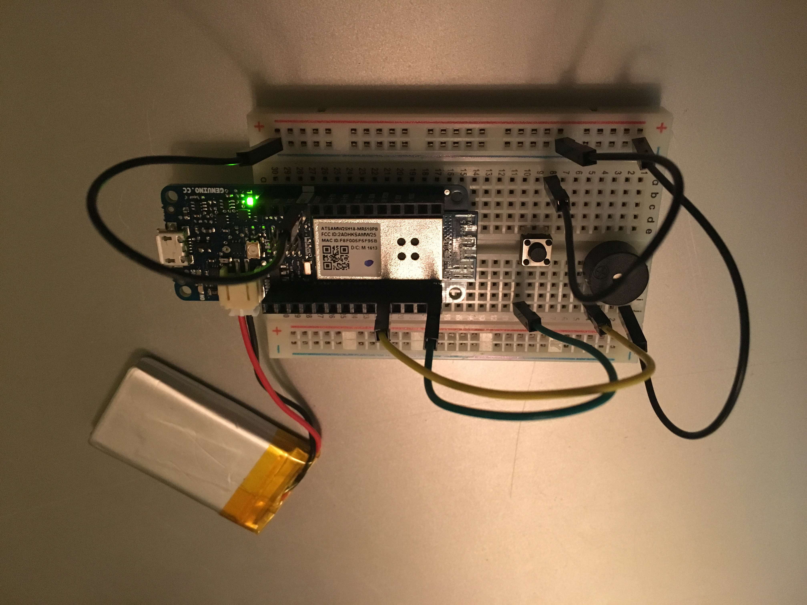

# Machine Learning Workshop

Machine Learning workshop for IDE Academy

## Remote control theremin

### Parts

* Arduino MKR1000 (any Arduino with a WiFi 101 Shield should work too)
* Buzzer
* Push button
* Breadboard
* Jumper wires
* Lithium polymer battery (optional)

### Assembly

Connect one buzzer pin to ground and the other to pin 1. Connect one push button pin to ground and the other to pin 5. Connect the Arduino's ground to the breadboard ground. Optionally connect lipo battery to MKR1000 for standalone operation.

### Software

You will need to install the [Wifi101](https://www.arduino.cc/en/Reference/WiFi101) library, and the [OSC](https://github.com/CNMAT/OSC) library.

Edit the sketch 'remoteControlTheremin' with your WiFi's SSID and password. The Arduino listens to messages on port 12000 with the address '/wek/outputs'. The first data position should contain a real number ranging from zero to one. Based on this number the Arduino will set the buzzer's tone to a pitch ranging from 16 to 2048 hertz. Push the button to stop playing the tone.

This was designed to be used with the [Wekinator](http://www.wekinator.org), but should work with anything capable of sending OSC messages over UDP.

### Sources

* WiFi code adapted from: https://www.arduino.cc/en/Tutorial/Wifi101ConnectWithWPA
* OSC code adapted from: https://github.com/CNMAT/OSC
* Buzzer code and hardware layout adapted from: https://learn.adafruit.com/adafruit-arduino-lesson-10-making-sounds/overview